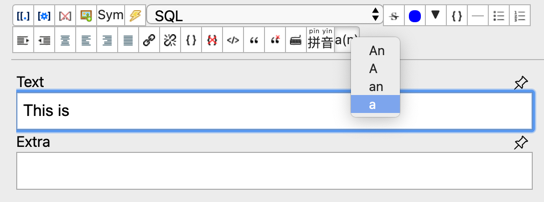
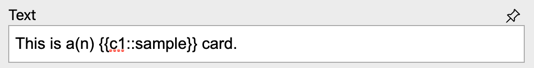
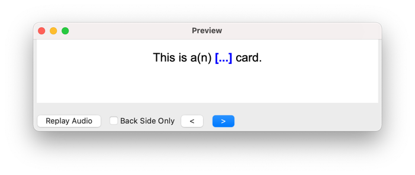
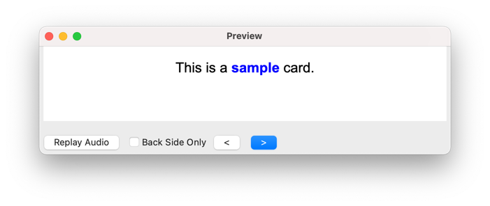

# a(n) plugin
Simple anki plugin to not give away how a word starts when doing 
fill-in-the-gap cards. Shows "a(n)" in the front and "a" or "an" in the back.

A word of warning: setting this up assumes familiarity with Anki and web technologies.

## Usage
When the setup is done (read below), you use the `a(n)` toolbar button to select
what you want to see in the back (e.g. `a`)

Then you can complete the card.

And enjoy the result:

You can also download this [sample card](doc/example.apkg).

## Setup
For the plugin to work you need to adapt the note type you want to use for
English clozes.

First, include this CSS by:

* Go to the card browser and select one card of the note type you want to use
* Click on `Cards...` > `Styling`
* Add this:

      .front-only {
        display: show;
      }
      .answer .front-only {
        display: none;
      }
    
Then, you need to have the back template marked with class `answer`. To do so,
click in `Back template` and surround the content with:

       

         ... your template...
       

